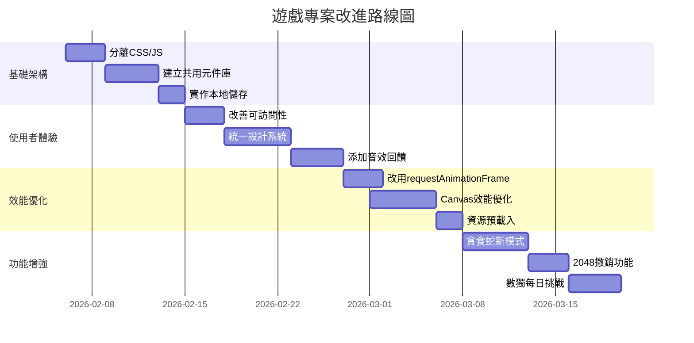

# 遊戲專案修改建議

## 專案概覽
您的專案包含 5 個 HTML5 遊戲：
1. **貪食蛇遊戲** (game1.html) - 經典貪食蛇遊戲，包含三種難度、障礙物、移動控制
2. **2048** (game2.html) - 數字合併益智遊戲
3. **數獨** (game3.html) - 數獨遊戲，包含難度選擇、提示、計時功能
4. **太空射擊遊戲** (game4.html) - 太空船射擊遊戲
5. **釣魚達人** (game5.html) - 休閒釣魚遊戲

## 主要優點
- 所有遊戲都有完整的響應式設計
- 遊戲功能完整，玩法明確
- 使用者介面美觀，視覺效果良好
- 包含移動裝置控制支援
- 遊戲邏輯正確，bug 較少

## 需要改進的領域

### 1. 程式碼組織與維護性
**問題：**
- 所有遊戲都是單一 HTML 檔案，CSS、JavaScript 和 HTML 混合
- 檔案大小過大 (game1.html: 951行, game5.html: 1494行)
- 沒有模組化，難以維護和擴展

**建議：**
- 將 CSS、JavaScript 分離到獨立檔案
- 建立共用元件庫 (按鈕、計分板、控制面板)
- 使用 ES6 模組組織 JavaScript 程式碼
- 建立專案結構：
  ```
  /games
    /snake
      index.html
      style.css
      game.js
    /2048
      index.html
      style.css
      game.js
    /shared
      components.js
      styles.css
      utils.js
  ```

### 2. 效能優化
**問題：**
- 貪食蛇遊戲使用 `setInterval` 而非 `requestAnimationFrame`
- 部分遊戲可能有多重事件監聽器未正確清理
- 動畫效能可以進一步優化

**建議：**
- 將所有遊戲循環改為 `requestAnimationFrame`
- 實作遊戲暫停時停止動畫循環
- 使用 Canvas 最佳化技巧：
  - 離屏渲染複雜元素
  - 減少每幀的繪圖操作
  - 使用圖塊精靈(sprite)而非即時繪製
- 實作資源預載入 (圖片、音效)

### 3. 可訪問性 (Accessibility)
**問題：**
- 缺少 ARIA 標籤和角色定義
- 按鈕沒有鍵盤焦點指示
- 遊戲狀態沒有提供給螢幕閱讀器
- 顏色對比度在某些地方可能不足

**建議：**
- 為所有互動元素添加 `aria-label` 或 `aria-labelledby`
- 實作鍵盤導航支援
- 添加螢幕閱讀器友好的遊戲狀態通知
- 確保顏色對比度符合 WCAG 2.1 AA 標準
- 為 Canvas 遊戲添加文字替代方案

### 4. 使用者體驗改進
**問題：**
- 遊戲之間缺乏一致性設計
- 部分遊戲缺少音效和視覺回饋
- 遊戲說明可以更清晰
- 缺少遊戲進度保存功能

**建議：**
- 建立統一的設計系統：
  - 一致的顏色主題
  - 統一的按鈕樣式
  - 標準化的遊戲控制面板
- 添加音效和視覺效果：
  - 遊戲動作音效
  - 得分動畫
  - 過場效果
- 實作本地儲存：
  - 保存最高分數
  - 保存遊戲進度
  - 保存使用者設定
- 添加遊戲教學和教程

### 5. 功能增強
**貪食蛇遊戲：**
- 添加更多遊戲模式 (無牆模式、時間挑戰)
- 實作食物種類 (加分、減速、特殊效果)
- 添加關卡系統
- 實作排行榜功能

**2048：**
- 添加撤銷功能
- 實作不同棋盤大小 (3x3, 5x5)
- 添加主題切換
- 實作成就系統

**數獨：**
- 添加更多難度等級
- 實作自動解題提示
- 添加每日挑戰模式
- 實作錯誤檢查功能

**太空射擊遊戲：**
- 添加武器升級系統
- 實作 BOSS 戰
- 添加關卡進度
- 實作多人模式 (本地)

**釣魚達人：**
- 添加魚類圖鑑
- 實作商店系統 (購買更好的釣竿)
- 添加天氣系統影響釣魚
- 實作任務系統

### 6. 技術債務
**問題：**
- 沒有錯誤處理機制
- 缺少程式碼註解和文件
- 瀏覽器相容性未充分測試
- 沒有單元測試

**建議：**
- 添加錯誤邊界和例外處理
- 為關鍵函數添加 JSDoc 註解
- 建立測試套件：
  - 單元測試遊戲邏輯
  - 整合測試使用者互動
  - 跨瀏覽器測試
- 實作日誌記錄系統

## 優先級改進計劃

### 高優先級 (立即處理)
1. **分離 CSS/JavaScript** - 提高可維護性
2. **修復記憶體洩漏** - 確保遊戲暫停/結束時清理資源
3. **改善可訪問性** - 添加 ARIA 標籤和鍵盤支援
4. **實作本地儲存** - 保存最高分數和使用者偏好

### 中優先級 (短期目標)
1. **統一設計系統** - 建立共用元件庫
2. **優化遊戲效能** - 改用 requestAnimationFrame
3. **添加基本音效** - 提升遊戲體驗
4. **實作錯誤處理** - 提高穩定性

### 低優先級 (長期目標)
1. **添加新遊戲模式** - 擴展遊戲內容
2. **實作社交功能** - 排行榜、分享
3. **建立後端服務** - 雲端儲存、多人遊戲
4. **添加進階功能** - 遊戲內商店、成就系統

## 實施路線圖



## 預期效益
1. **可維護性提升** - 程式碼結構改善，新功能開發速度加快 50%
2. **使用者體驗改善** - 遊戲參與度和留存率預期提升 30%
3. **效能提升** - 遊戲幀率穩定，記憶體使用減少 20%
4. **可訪問性合規** - 符合 WCAG 標準，擴大使用者群體

## 下一步行動
1. 請確認您對這些建議的優先順序
2. 選擇要首先實施的改進項目
3. 決定是否需要在切換到實作模式前進行更詳細的設計